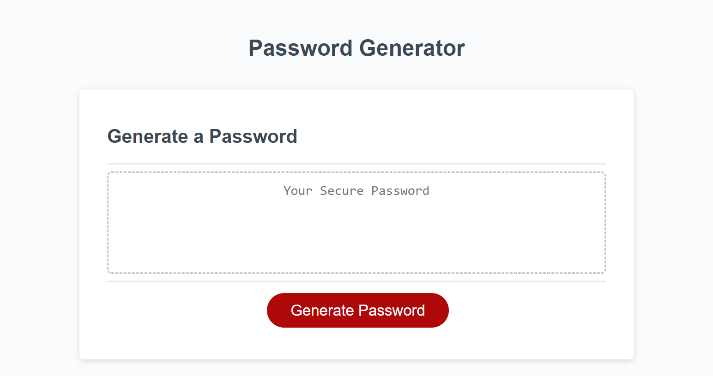
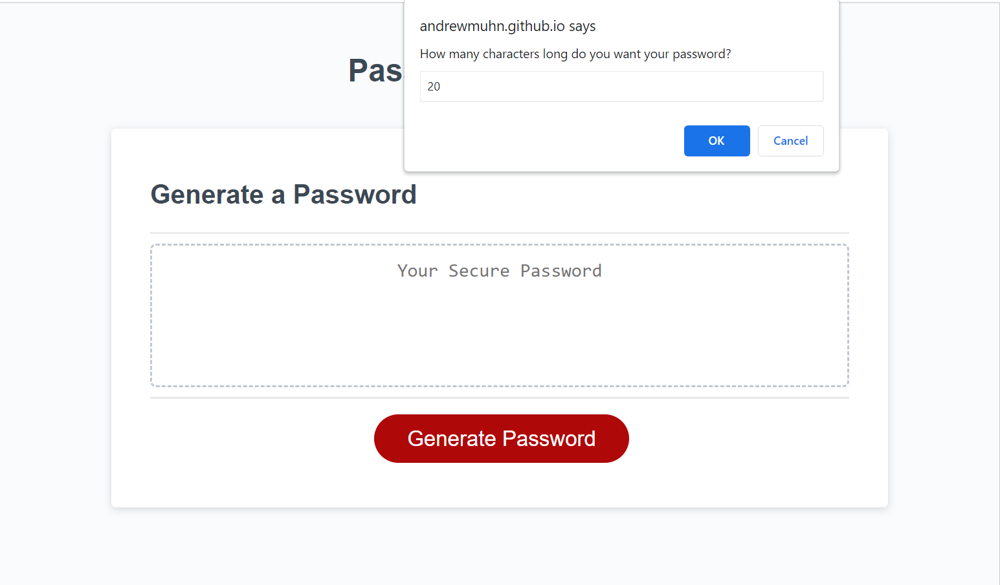
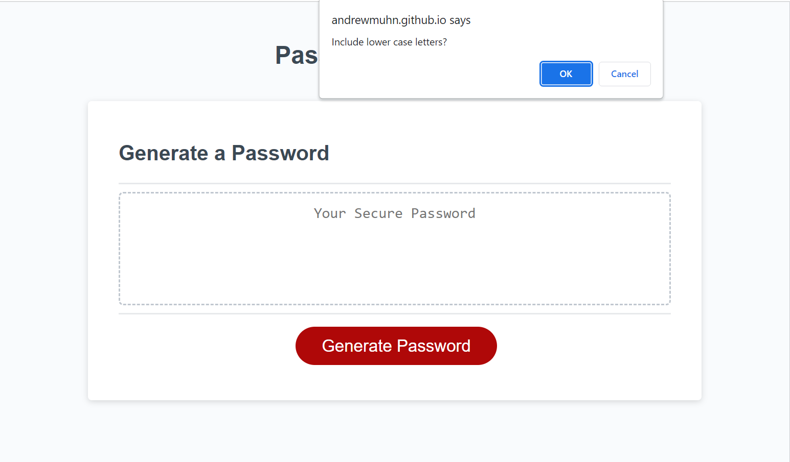
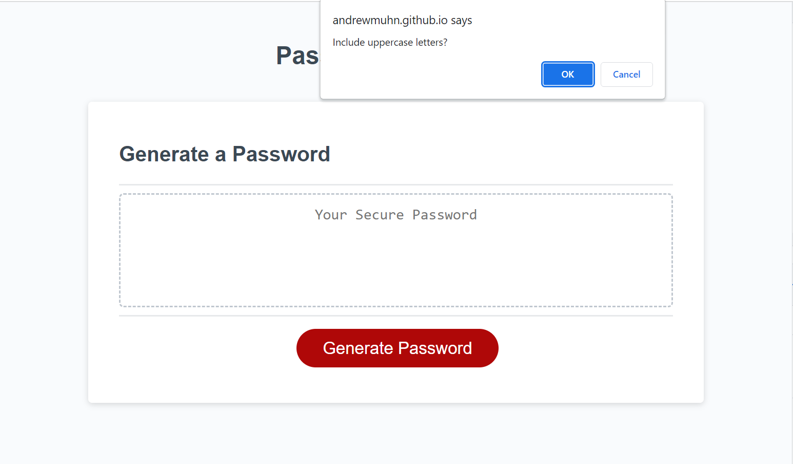
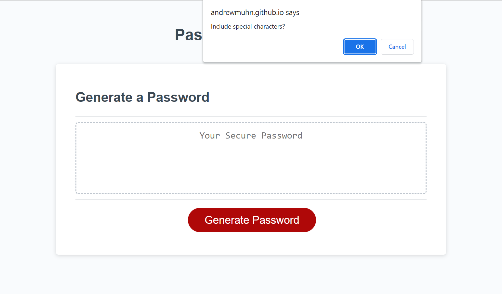
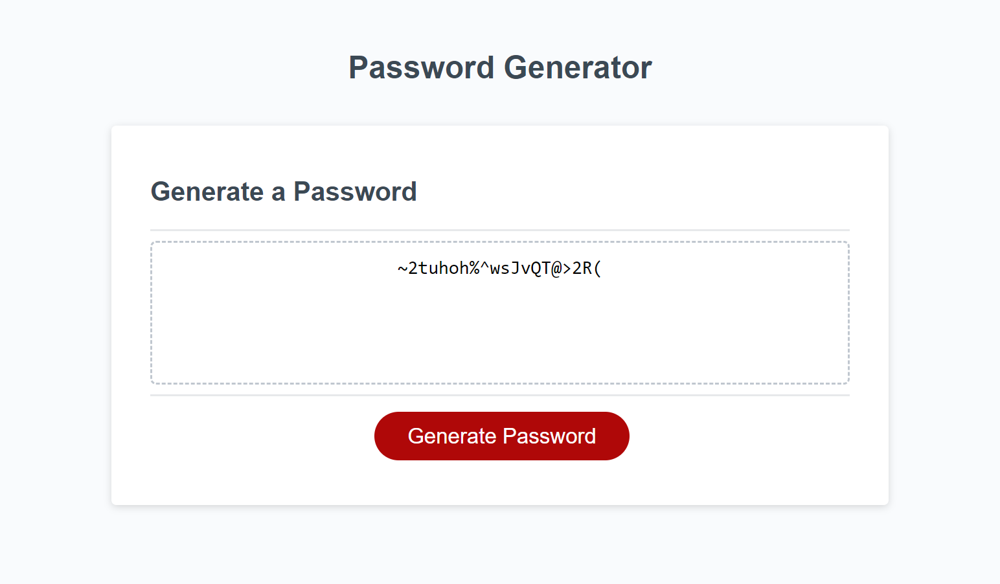
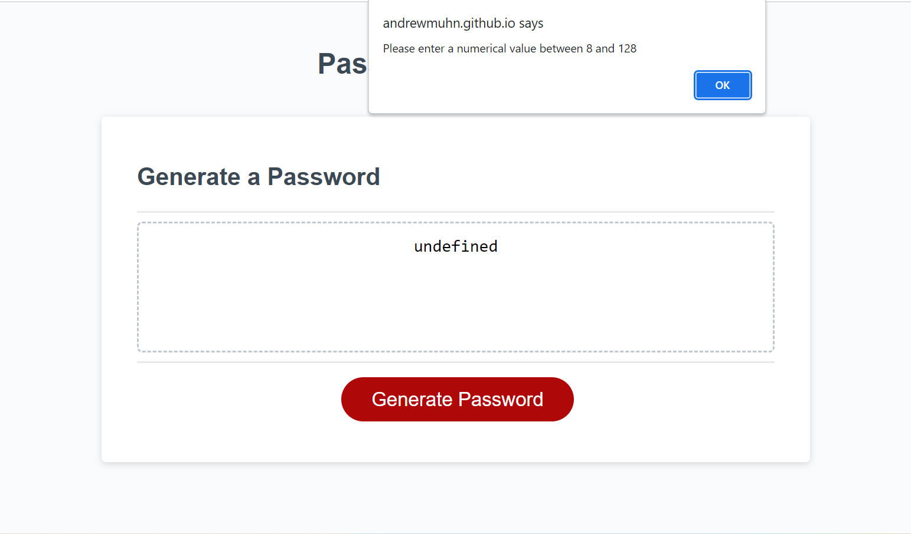
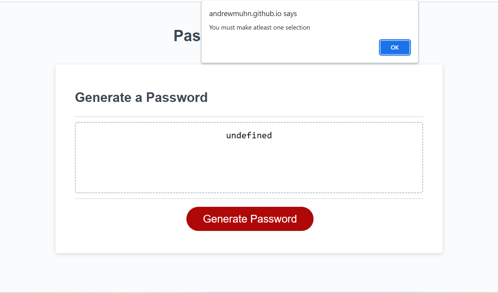
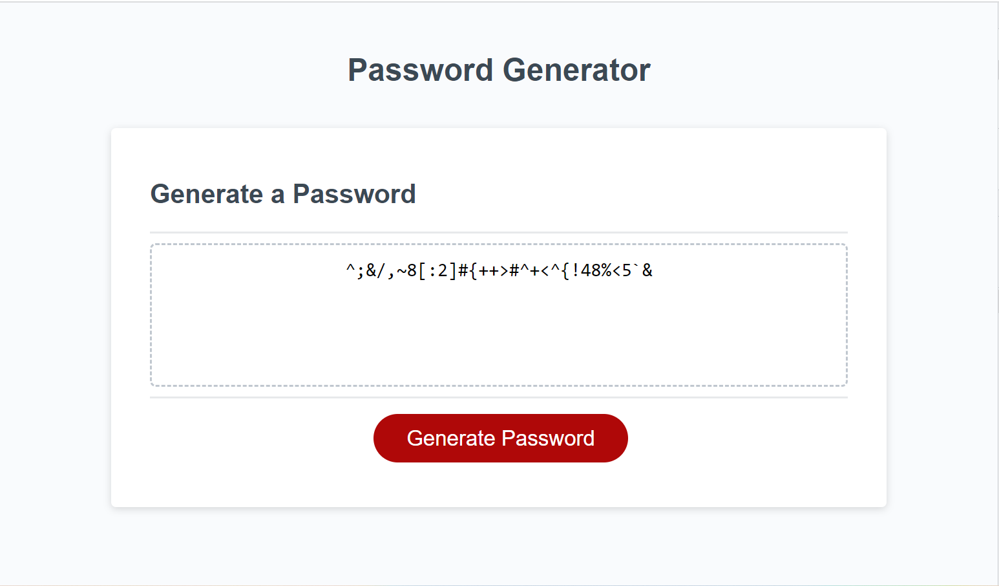

# <Password-Generator>

## Description

Provide a short description explaining the what, why, and how of your project. Use the following questions as a guide:

-My goal was to create a site that would generate a password based of the user inputs of length and type of characters (lower case, upper case, numbers, and special characters)

-I built this project to practice javascript. Specifically functions and various notations (decleration vs arrow expression), for loops to iterate through a block of code multiple times, using user inputs to direct the code through dialog boxes, and scope of variables.

-This application will generate a random password based off of user criteria

## Usage
[Link to deployed app](https://andrewmuhn.github.io/password-generator/)

-Click 'Generate Password' button

-Enter in the desired length of password between 8 and 128 characters

-Select your password criteria (lower case, upper case, numbers, and special characters)

-See generated password

## Credits

## Tests

-If user inputs something other than a number into text field:

	-Expected output: Dialog box with text: "Please enter a numerical value between 8 and 128"

-If user inputs number below 8 or above 128:

	-Expected output: Dialog box with text: "Please enter a numerical value between 8 and 128"

-If user doesn't select any criteria

	-Expected output: Dialog box with text: "You must make atleast one selection"

-If user selects different criteria

	-Generated password should only contain characters from selected criteria

	-Example image selections: 30 characters, only numbers and special characters

